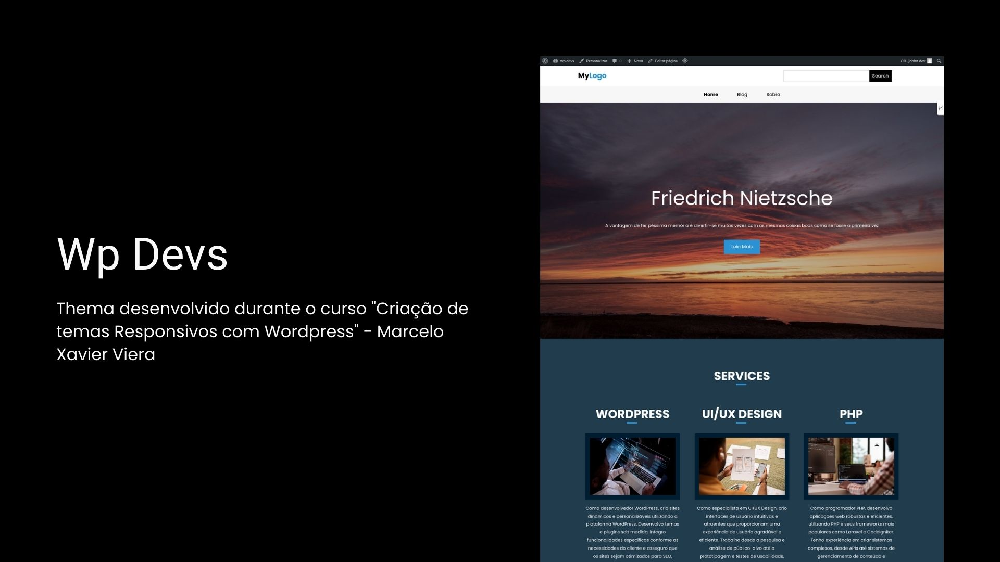

# WP Devs

## Índice

## Funcionalidades

- Logo personalizado
- Menu personalizado
- Hero customizável com imagem e texto
- Sistema de blog
- Sistema de busca de postes
- Template geral

## Demonstração

Link: https://wp-devs.pragmatico.dev/

## Tecnologias

## Abrir e rodar o projeto

Após concluir a instalação do LAMP, siga estes passos:

1. Faça o download do WordPress a partir deste link: (https://br.wordpress.org/download/).
2. Instale e configure o WordPress conforme as instruções.
3. Vá até a pasta chamada "wp-content/themes".
4. Crie uma nova pasta dentro dela com o nome "wp-devs".
5. Coloque todos os arquivos que você baixou deste repositório dentro da pasta "wp-devs".
6. Agora, ative o tema que você acabou de adicionar.
7. Crie uma página e defina a mesma como página inicial

## Como contribuir

1. Faça um fork do projeto: https://github.com/jonathan-matheus/wp-devs
2. Clone o seu fork para sua maquina: `git clone git@github.com:jonathan-matheus/wp-devs.git`
3. Crie uma branch para realizar sua modificação: `git checkout -b name_new_feature`
4. Adicione suas modificações e faça commit: `git commit -m "Descreva sua modificação"`
5. Push: `git push origin name_new_feature`
6. Crie um novo Pull Request
7. Pronto, agora só aguarde a análise

## Autor

| [ Jonathan Matheus](https://github.com/jonathan-matheus)
| :---: |
